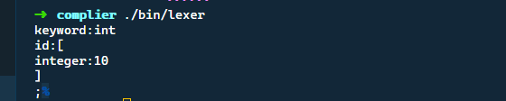
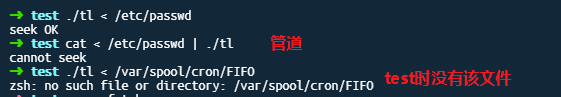

# QT

## 配置


# C++

## C++历史


1. C++98
2. C++03
3. TR1:标准库的扩充
4. C++11


##  查看c++的编译器支持的版本


> 每个编译器都定义了宏 __cplusplus


## nullptr

> 用来表示空指针

```cpp
void f(int); 	//1
void f(void*);  //2

f(0);			// call 1 
f(NULL);		// 如果NULL被定义成0 那么调用1 这个有歧义
f(nullptr);     // call 2
```

> 所以空指针用nullptr,不要用NULL


# LINUX


## 位操作

### 与操作

> 同为1为1

1. 某些位清0同时保留其他位不变   -> 清零位与0 保留位与1
2. 获取某一位 -> 其他位与0 获取位与1


### 或操作

> 同为0为0

1. 某些位置1保留其他位不变 -> 置1为或1 其他位或0


### 异或操作

> 不同为1 相同为0

1. 某些位取反,保留其他位不变  -> 取反位异或1 其他异或0

> a^b = c ==> c^b=a c^a=b
>
> 可以利用这个原理进行加密解密

> 交换两个变量的值

```cpp
int a =5,b=7;
a=a^b;
b=b^a;
a=a^b;
```


## 切换源


### 先备份原先的源文件

```shell
sudo cp /etc/apt/sources.list /etc/apt/sources_bk.list
```


### 打开source.list,复制进阿里云镜像

```shelll
deb http://mirrors.aliyun.com/ubuntu/ xenial main restricted
deb-src http://mirrors.aliyun.com/ubuntu/ xenial main restricted multiverse universe #Added by software-properties
deb http://mirrors.aliyun.com/ubuntu/ xenial-updates main restricted
deb-src http://mirrors.aliyun.com/ubuntu/ xenial-updates main restricted multiverse universe #Added by software-properties
deb http://mirrors.aliyun.com/ubuntu/ xenial universe
deb http://mirrors.aliyun.com/ubuntu/ xenial-updates universe
deb http://mirrors.aliyun.com/ubuntu/ xenial multiverse
deb http://mirrors.aliyun.com/ubuntu/ xenial-updates multiverse
deb http://mirrors.aliyun.com/ubuntu/ xenial-backports main restricted universe multiverse
deb-src http://mirrors.aliyun.com/ubuntu/ xenial-backports main restricted universe multiverse #Added by software-properties
deb http://archive.canonical.com/ubuntu xenial partner
deb-src http://archive.canonical.com/ubuntu xenial partner
deb http://mirrors.aliyun.com/ubuntu/ xenial-security main restricted
deb-src http://mirrors.aliyun.com/ubuntu/ xenial-security main restricted multiverse universe #Added by software-properties
deb http://mirrors.aliyun.com/ubuntu/ xenial-security universe
deb http://mirrors.aliyun.com/ubuntu/ xenial-security multiverse
deb https://mirrors.tuna.tsinghua.edu.cn/ubuntu/ bionic main restricted universe multiverse
deb-src https://mirrors.tuna.tsinghua.edu.cn/ubuntu/ bionic main restricted universe multiverse
deb https://mirrors.tuna.tsinghua.edu.cn/ubuntu/ bionic-updates main restricted universe multiverse
deb-src https://mirrors.tuna.tsinghua.edu.cn/ubuntu/ bionic-updates main restricted universe multiverse
deb https://mirrors.tuna.tsinghua.edu.cn/ubuntu/ bionic-backports main restricted universe multiverse
deb-src https://mirrors.tuna.tsinghua.edu.cn/ubuntu/ bionic-backports main restricted universe multiverse
deb https://mirrors.tuna.tsinghua.edu.cn/ubuntu/ bionic-security main restricted universe multiverse
deb-src https://mirrors.tuna.tsinghua.edu.cn/ubuntu/ bionic-security main restricted universe multiverse
deb https://mirrors.tuna.tsinghua.edu.cn/ubuntu/ bionic-proposed main restricted universe muldebtiverse
deb https://mirrors.ustc.edu.cn/ubuntu/ bionic main restricted universe multiverse
deb-src https://mirrors.ustc.edu.cn/ubuntu/ bionic main restricted universe multiverse
deb https://mirrors.ustc.edu.cn/ubuntu/ bionic-updates main restricted universe multiverse
deb-src https://mirrors.ustc.edu.cn/ubuntu/ bionic-updates main restricted universe multiverse
deb https://mirrors.ustc.edu.cn/ubuntu/ bionic-backports main restricted universe multiverse
deb-src https://mirrors.ustc.edu.cn/ubuntu/ bionic-backports main restricted universe multiverse
deb https://mirrors.ustc.edu.cn/ubuntu/ bionic-security main restricted universe multiverse
deb-src https://mirrors.ustc.edu.cn/ubuntu/ bionic-security main restricted universe multiverse
```

### 更新源和软件

```shell
sudo apt-get update 
sudo apt-get upgrade
```


## 科学上网

chrome extentions:

①Adguard VPN；（免费，随便注册邮箱，速度5k左右） 

②Free VPN（免费，直接使用，速度5K左右） 

③Ghelper（需要VIP，我是白嫖的，速度最快是20K） 

④Hoxx VPN Proxy（免费，注册使用，速度1K左右）

 ⑤1Click VPN（速度2K左右）


本期视频资源地址：
1、1clickVPN：https://chrome.google.com/webstore/detail/fcfhplploccackoneaefokcmbjfbkenj
2、Astar VPN：https://chrome.google.com/webstore/detail/astar-vpn-free-and-fast-v/jajilbjjinjmgcibalaakngmkilboobh
3、VeePN：https://chrome.google.com/webstore/detail/veepn-unlimited-free-fast/majdfhpaihoncoakbjgbdhglocklcgno
4、Unlimited VPN proxy：[https://chrome.google.com/webstore/detail/unlimited-vpn-proxy-%E2%80%93-unb/nkmghlbiclohebhhoapdhcflibiibeak](https://chrome.google.com/webstore/detail/unlimited-vpn-proxy-–-unb/nkmghlbiclohebhhoapdhcflibiibeak)
5、Free VPN：https://chrome.google.com/webstore/detail/free-vpn-the-fastest-vpn/nkomfibbgccdjcahcpleidblgknecfhh


## zsh 的折腾


### 安装

```shell
sudo apt-get install -y zsh
```


### 主题-oh  my zsh

[oh-my-zsh](https://github.com/ohmyzsh/ohmyzsh/)

```shell
sh -c "$(curl -fsSL https://raw.githubusercontent.com/ohmyzsh/ohmyzsh/master/tools/install.sh)"
```

### 配置文件

```shell
~/.zshrc
```


### 设置zsh为系统登陆终端

> 新版有提示说让改默认的shell

```shell
chsh -s `which zsh`
```


### 主题


```shell
sudo apt-get install npm
npm install --global pure-prompt
```


## vscode 的折腾


### vscode 与git

#### 初始化git 

> 使得git可以追踪文件


#### 与github 同步

创建github 仓库 

vscode `ctrl shift p` 调出命令 输入

```shell
git add remote
```

复制github的链接地址

然后根据提示输入用户名和密码 

最后进行同步


### 常用插件


## windows terminal 的折腾

配置文件:

```json
// To view the default settings, hold "alt" while clicking on the "Settings" button.
// For documentation on these settings, see: https://aka.ms/terminal-documentation

{
    "$schema": "https://aka.ms/terminal-profiles-schema",

    "defaultProfile": "{c6eaf9f4-32a7-5fdc-b5cf-066e8a4b1e40}",
    "initialRows": 30,
    "initialCols": 130,
    "alwaysShowTabs": true,
    "showTerminalTitleInTitlebar": false,
    "experimental_showTabsInTitlebar": true,
    "profiles": {
        "defaults": {
            // Put settings here that you want to apply to all profiles
            "cursorColor" : "#eff300",
            "cursorShape" : "underscore",
            "fontFace" : "Cascadoa Code Regular",
            "fontSize" : 14,
            "icon": "C:/Users/tailiang/Pictures/w/linux_logo.ico",
            "useAcrylic": true,
            "acrylicOpacity": 0.9,
            "historySize": 9001,
            "name": "txl ubuntu",
            "colorScheme": "Campbell",
            "startingDirectory": "C:\\Users\\tailiang\\Desktop\\complier",
            //"backgroundImage":"C:/Users/tailiang/Pictures/w/ew.jpg",
            "backgroundImageOpacity": 0.5,
            "antialiasingMode": "aliased"
        },
        "list": [{
                // Make changes here to the powershell.exe profile
                "guid": "{61c54bbd-c2c6-5271-96e7-009a87ff44bf}",
                "name": "Windows PowerShell",
                "commandline": "powershell.exe",
                "hidden": false
            },
            {
                // Make changes here to the cmd.exe profile
                "guid": "{0caa0dad-35be-5f56-a8ff-afceeeaa6101}",
                "name": "cmd",
                "commandline": "cmd.exe",
                "hidden": false
            },
            {
                "guid": "{6f9994f0-4403-5e85-9cce-98e5da3839bb}",
                "hidden": false,
                "name": "Ubuntu-16.04",
                "source": "Windows.Terminal.Wsl"
            },
            {
                "guid": "{b453ae62-4e3d-5e58-b989-0a998ec441b8}",
                "hidden": false,
                "name": "Azure Cloud Shell",
                "source": "Windows.Terminal.Azure"
            },
            {
                "guid": "{c6eaf9f4-32a7-5fdc-b5cf-066e8a4b1e40}",
                "hidden": false,
                "name": "txl ubuntu",
                "source": "Windows.Terminal.Wsl"
            }
        ]

    },

    // Add custom color schemes to this array
    "schemes": [
        {
            "name" : "Campbell",
            "background" : "#050505",
            "black" : "#0C0C0C",
            "blue" : "#0037DA",
            "foreground" : "#F2F2F2",
            "green" : "#13A10E",
            "red" : "#C50F1F",
            "white" : "#CCCCCC",
            "yellow" : "#C19C00"
        }
    ],

    // Add any keybinding overrides to this array.
    // To unbind a default keybinding, set the command to "unbound"
    "keybindings": []

   
}
```


## ERROR :wrench:


### zsh: exec format error: bin/lexer 

> 在wsl中同样的命令 一个是在同一个文件夹下编译cpp文件 得到一个shared object 一个编译到bin目录中去,却是relocatable


#### Solve :ok:

原因是编译的时候使用了-c 选项 而这个选项不能产生二进制的执行文件

去掉-c


### file not open


#### solve  :ok:


### invalid token

> flex 没有报错 也没有warnning,但总是到文件的最后出现解析错误


#### solve :ok:

> 去掉最后的匹配 因为最后是一个EOF .也能够匹配到 所以进入了exit


> 去掉之后执行 flex会自动执行到最后




### error


## mips安装

```shell
sudo apt install gcc-mips-linux-gnu
```


检查:

```shell
mips-linux-gnu-gcc -dumpmachine
```

若输出如下,则表示成功


## qemu 安装


```shell
sudo apt-get install gcc-arm-linux-gnueabi
sudo apt-get install qemu
```


## chrome 插件


1. Astar
2. octotree
3. Vimium


## makefile


### 特殊变量

```makefile
$@ --目标文件，记忆: @谁 就是目标是谁 所以表示目标文件
$^ --所有的依赖文件，记忆:向上箭头表示依赖于上层的谁,所以是依赖文件
$< --第一个依赖文件。记忆:
$?   表示比目标还要新的依赖文件列表
```


### addprefix 函数

```makefile
$(addprefix 添加的前缀,需要添加的字符串1 需要添加的字符串2 ...)
```


### addsuffix函数

```makefile
$(addsuffix 添加的前缀,需要添加的字符串1 需要添加的字符串2 ...)
```


### wildcard 函数

> 获取和当前模式匹配的文件名

```makefile
SRC = $(wildcard *.c ./foo/*.c) #
```


###  notdir 函数

> 去除所有的目录信息


### patsubst 函数

patten substitude 模式替换

```makefile
OBJ = $(patsubst %.c %.o $(SRC)) # 在SRC中找到所有.c 结尾的文件，然后把所有的.c换成.o。
```


## linux 命令


+ 命令行中只要是`*`出现得地方,shell都会进行替换
+ shell 使用空格作为单词的分隔符


### 代码行

> 统计代码行数

```shell
 wc -l `find -name '*.cpp' `
 
 wc -l `find -name '*.hpp' `
```


### 正则

流编辑器ed file

> 在ed编辑器中,正则特定的符号只在搜索字符串中有效(第一个/后的字符串),在替换字符串中只看做普通的字符(第二个/后的字符串)


```shell
1,$p # 打印全部的行 1,$表示从第一行到最后一行
/ ... / # 查找由空格包围的三个字符
1,$s/p.o/XXX/g # 在第一行到最后一行这个范围中,s表示替换命令 将p.o 其中.表示任意一个字符 替换成XXX g表示全局替换 不单单是一行
/^the/ #查找已the开头的行
/ #表示重复上一次搜索
1,$s/^/>>/ # 在每一行开头插入>>
/\.$/ # 已.号结尾的行
1,$s/..$// # 删除每行最后两个字符
/^$/ # 空行
q # 退出
1,$s/ */ /g # 将多个空格修改成单个空格
1,$s/^.\{10\}// # 将每行开始的前10个字符删除 {n,m}匹配的次数 {要进行转义


```


### shell的执行过程

1. shell判断该命令是否为内建命令(cd,pwd,echo...),如果是,则直接执行
2. shell搜索磁盘,查找环境变量PATH中指定的所有目录,直到找到指定的程序
3. 找到后,shell会将自己复制一份(子shell)
4. 让内核使用指定的程序替换这个子shell
5. 登陆的shell会进行休眠
6. 内核将指定`程序`复制到内存中并开始执行-->`进程`


### 重定向


> 可以看出细微的差别
>
> 当wc 从test.txt文件中读取 ,那wc是知道输入的文件就是test.txt
>
> 但是当test.txt重定向给wc时,wc不知道这个东东是来自终端还是文件


### 管道

UNIX 可以将两个命令连接在一起,这种连接就是管道.--> 

>  **可以将一个命令的输出直接作为另一个命令的输入**
>
> 注意:有一个重要的前提就是第一个命令会将输出写到标准输出,而第二个命令则会从标准输入中读取输入.

```shell
ls | wc -l
# ls会将输出写到标准输出
# wc 会从标准输入中读取输入
```


### basename

> 获取最后的路径名


### wc

+ -l ;line 行数
+ -w 单词数
+ -c 字符数


### pushd 和 popd

> pushd 可以将当前目录存储起来 然后进入新的目录下工作 完了之后可以直接popd回到原来得工作路径


### ps


### ping and telnet
1. ping + ip： 查看某一个ip地址是否能够连通，如： ping 114.80.67.193

2. telnet ip port ： 查看某一个机器上的某一个端口是否可以访问，如：telnet 114.80.67.193 8080


### od

> 格式化打印文件内容

```shell
od -c file # 以字符形式打印文件内容
```


## UNIX 系统编程

### :question: 问题

#### :grey_question: 01 perror的参数是有const,而strerror没有,why?

void perror(const char *s);

char *strerror(int errnum);


#### :grey_question: 02 日历时间和进程时间都存放在32的带符号的整型中,什么时候会溢出?


### 手册

>  man 2 : 系统调用

> man 3: 库函数

### 错误处理

> exit(errno) 0表示成功 1-255表示错误
>
> errno:
>
> + 如果没有出错,那么errno的值不会被清除
> + 任何函数都不会将errno设置为0

```cpp
#include <errno.h>		/* for definition of errno */
#include <stdarg.h>		/* ISO C variable aruments */
#define SYS_CALL_ERROR 1		/* errnoflag */
#define NOT_SYS_CALL_ERROR 0	/* errnoflag */

/*
* @Description: Print a message and return to caller. Caller specifies "errnoflag".
* @param-errnoflag:
* @param-error:
* @param-fmt:
* @param-ap:
* @return:void
*/
static void err_doit(int errnoflag, int error, const char *fmt, va_list ap)
{
	char	buf[MAXLINE];
	vsnprintf(buf, MAXLINE-1, fmt, ap);
	if (errnoflag)
	{
        //* strerror : errno -> error string
		snprintf(buf+strlen(buf), MAXLINE-strlen(buf)-1, ": %s", strerror(error));
	}
	strcat(buf, "\n");
	fflush(stdout);		/* in case stdout and stderr are the same */
	fputs(buf, stderr);
	fflush(NULL);		/* flushes all stdio output streams */
}

/*
* @Description: Fatal error unrelated to a system call. Print a message and terminate.
* @param-fmt: variable parameter list
* @return:void
*/
void err_quit(const char *fmt, ...)
{
	va_list		ap;
	va_start(ap, fmt); /* ap points to a variable parameter list */
	err_doit(NOT_SYS_CALL_ERROR, 0, fmt, ap);//errnoflag = 0
	va_end(ap);
	exit(EXIT_FAILURE);
}

/*
* @Description: Fatal error related to a system call.Print a message and terminate.
* @param-fmt: variable parameter list
* @return:void
*/
void err_sys(const char *fmt, ...)
{
	va_list		ap;
	va_start(ap, fmt);/* ap points to a variable parameter list */
	err_doit(SYS_CALL_ERROR, errno, fmt, ap);//errnoflag = 1
	va_end(ap);
	exit(EXIT_FAILURE);
}


```

```cpp
#include <errno.h>
#include <stdio.h>
#include <stdlib.h>
#include <string.h>

int main(int argc, char *argv[])
{
	fprintf(stderr, "EACCES: %s\n", strerror(EACCES));
	errno = ENOENT;
	perror(argv[0]);//* msg: error message corresponding to errno
	exit(EXIT_SUCCESS);
}
```


### ls 实现 只列出目录

```cpp
#include <dirent.h>
#include <stdlib.h>
#include <stdio.h>
#include <string.h>

#define	MAXLINE	4096	/* max line length */

/*
* @Author: TaiLiang
* @LastEditTime: 2020/04/19/10/01/37
* @FilePath: /mnt/c/Users/tailiang/Desktop/AllForOne/test/apue/ch01/ls.c
* @Function: Only show directories under specified directory including . and ..
* @param: ls dicrector
* @return:
*/
int main(int argc, char *argv[])
{
	DIR				*dp;
	struct dirent	*dirp;

	if (argc != 2)
	{
		err_quit("usage: ls directory_name"); /* termination not caused by system call */
	}

	if ((dp = opendir(argv[1])) == NULL) /* opendir return the pointer pointe to structure DIR */
	{
		err_sys("can't open %s", argv[1]); /* termination cauesd by system call */
	}
	while ((dirp = readdir(dp)) != NULL)
	{
		printf("%s\n", dirp->d_name);//目录名
	}

	closedir(dp);
	exit(EXIT_SUCCESS);
}

```


### 进程ID 和 用户ID

> 用户id 标识每一个登陆的用户

```cpp
#include <stdio.h>
#include <stdlib.h>
#include <sys/types.h>
#include <unistd.h>

int main(void)
{
	/**
	 * improve portability with long integers
	 */
	printf("uid = %d, gid = %d\n", getuid(), getgid());
	exit(EXIT_SUCCESS);
}


```


### 进程控制

```cpp
#include <stdio.h>
#include <string.h>
#include <stdlib.h>
#include <sys/wait.h>
#include <sys/types.h>
#include <unistd.h>
#include "myerror.h"

#define	MAXLINE	4096	/* max line length */


int main(void)
{
	char	buf[MAXLINE];
	pid_t	pid;
	int		status;

	printf("%% ");	/* print prompt (printf requires %% to print %) */
	while (fgets(buf, MAXLINE, stdin) != NULL) 
	{
		/* 
		 * remove newline charactor 
		 * because the parameters required by the execlp function end with null instead of a newline
		 */
		if (buf[strlen(buf) - 1] == '\n')
		{
			buf[strlen(buf) - 1] = 0; /* replace newline with null */
		}
		
		if ((pid = fork()) < 0) 
		{
			err_sys("fork error");
		} 
		else if (pid == 0) 
		{/* child */
			execlp(buf, buf, (char *)0);//* excute user-specified commands but cannot pass command parameters
			err_ret("couldn't execute: %s", buf);
			exit(127); //? why 127
		}

		/* parent */
		if ((pid = waitpid(pid, &status, 0)) < 0)
		{
			err_sys("waitpid error");
		}
		printf("%% ");
	}
	exit(EXIT_SUCCESS);
}

```


### 信号

处理信号的三种方式:

1. 忽略信号
2. 按系统默认的方式处理
3. 自定义信号处理函数


```cpp
#include <stdio.h>
#include <string.h>
#include <stdlib.h>
#include <sys/wait.h>
#include <sys/types.h>
#include <unistd.h>
#include "myerror.h"
#include <signal.h> //for signal

#define	MAXLINE	4096	/* max line length */

static void sig_int(int signo) /* our signal-catching function */
{
	printf("interrupt\n%% ");
}

int main(void)
{
	char	buf[MAXLINE];
	pid_t	pid;
	int		status;

	if (signal(SIGINT, sig_int) == SIG_ERR)
		err_sys("signal error");


	printf("%% ");	/* print prompt (printf requires %% to print %) */
	while (fgets(buf, MAXLINE, stdin) != NULL) 
	{
		/* 
		 * remove newline charactor 
		 * because the parameters required by the execlp function end with null instead of a newline
		 */
		if (buf[strlen(buf) - 1] == '\n')
		{
			buf[strlen(buf) - 1] = 0; /* replace newline with null */
		}
		
		if ((pid = fork()) < 0) 
		{
			err_sys("fork error");
		} 
		else if (pid == 0) 
		{/* child */
			execlp(buf, buf, (char *)0);//* excute user-specified commands but cannot pass command parameters
			err_ret("couldn't execute: %s", buf);
			exit(127); //? why 127
		}

		/* parent */
		if ((pid = waitpid(pid, &status, 0)) < 0)
		{
			err_sys("waitpid error");
		}
		printf("%% ");
	}
	exit(EXIT_SUCCESS);
}

```


### 时间

1. time_t

   > 日历时间.UTC:1970-01-01-00-00-00以来经历的秒数累计值
   >
   > 可用来记录文件最近一次的修改时间 

2. clock_t

   > 进程时间/CPU时间


### 不带缓冲的IO

> BUFSIZE 设置为4096时 性能最优 


> 文件描述符
>
> POSIX:
>
> + STDIN_FILENO 
>
> + STDOUT_FILENO 
> + STDERR_FILENO
>
> 文件指针:
>
> + stdin
> + stdout
> + stderr

+ open
+ openat
+ create
+ close
+ lseek
  + 返回值是偏移量,可以为负数,所以验证lseek是否发生错误时要用==-1
  + 该偏移量用于下次读或者写操作
  + 文件偏移量可以大于文件的当前长度---> 形成空洞hole
  + SEEK_SET : 表示从距离文件开始处算
  + SEEK_CUR : 表示从当前值开始算
  + SEEK_END: 表示从文件当前长度开始算
  + 
+ read
+ write
+ dup
+ dup2
+ fcntl
+ ioctlsync
+ fsync
+ fdatasync


```cpp

#include <stdio.h>
#include <unistd.h>
#include <fcntl.h>
#include <stdlib.h>

/*
* @Author: TaiLiang
* @LastEditTime: 2020/04/19/17/20/01
* @FilePath: /mnt/c/Users/tailiang/Desktop/AllForOne/test/main.c
* @Function: test if standard input can be set offset
* @param:
* @return:
*/
int main(void)
{
	if (lseek(STDIN_FILENO, 0, SEEK_CUR) == -1) //* lseek must be test equal -1
	{
		printf("cannot seek\n");
	}
	else
	{
		printf("seek OK\n");
	}
	exit(EXIT_SUCCESS);
}

```

### :grey_question: 没有FIFO



测试的机器:


```cpp
#include <fcntl.h>
#include <unistd.h>
#include <stdlib.h>
#include <stdio.h>
#include <string.h>

#include "myerror.h"

/*
 * Default file access permissions for new files.
 */
#define	FILE_MODE	(S_IRUSR | S_IWUSR | S_IRGRP | S_IROTH)


char	buf1[] = "abcdefghij";
char	buf2[] = "ABCDEFGHIJ";

int main(void)
{
	int		fd;

	//* create a file 
	if ((fd = creat("file.hole", FILE_MODE)) < 0)
	{
		err_sys("creat error");
	}
	//* write 10 bytes to file
	if (write(fd, buf1, 10) != 10)
	{
		err_sys("buf1 write error");
	}
	/* offset now = 10 */

	//* set the current file pointer to 16384 bytes
	if (lseek(fd, 16384, SEEK_SET) == -1)
	{
		err_sys("lseek error");
	}
	/* offset now = 16384 */

	//* write 10 bytes again
	if (write(fd, buf2, 10) != 10)
	{
		err_sys("buf2 write error");
	}
	/* offset now = 16394 */

	exit(EXIT_SUCCESS);
}

```


> 前面的八进制表示字节的偏移量

### :grey_question: APUE书上测试的时候用无空洞和有空洞的进行比较时,两者的size是不一样的

 

我测试的时候:


```cpp
#include <stdio.h>
#include <stdlib.h>
#include <unistd.h>
#include <string.h>

#include "myerror.h"

#define	BUFFSIZE	4096

/*
* @Author: TaiLiang
* @LastEditTime: 2020/04/19/19/11/13
* @FilePath: /mnt/c/Users/tailiang/Desktop/AllForOne/test/main.c
* @Function: cat
* @param:
* @return:
*/
int main(void)
{
	int		n;
	char	buf[BUFFSIZE];

	while ((n = read(STDIN_FILENO, buf, BUFFSIZE)) > 0)
	{
		if (write(STDOUT_FILENO, buf, n) != n)
		{
			err_sys("write error");
		}
	}

	//* when the end of the file is reached,it returns 0
	if (n < 0)
	{
		err_sys("read error");
	}

	exit(EXIT_SUCCESS);
}
```


### 共享文件原理

> 每个进程都有一个进程表项


> 两个独立进程各自打开同一个文件--> 共享文件
>
> 说明:
>
> + 第一个进程在文件描述符3上打开文件,第二个进程在文件描述符4上打开文件.
>
> + 但是一个文件只有一个V节点表项 v-node table entry
> + 每个进程都拥有自己的文件表项 file table entry,这是表示每个进程都有它自己的对该文件的当前偏移量
> + lseek 只修改文件表项当前的文件偏移量,不进行任何的IO操作


> 如果用O_APPEND标志打开一个文件:
>
> 1. 设置文件表项的文件状态标志
> 2. 文件表项中的当前文件偏移量被设置成V节点的当前文件长度,这样每次写入的数据都追加到当前尾端处

### 文件状态标志


```cpp
#include <fcntl.h>
#include <stdlib.h>
#include <string.h>
#include <stdio.h>

#include "myerror.h"

int main(int argc, char *argv[])
{
	int		val;

	if (argc != 2)
	{
		err_quit("usage: ./tl <descriptor#>");
	}

	if ((val = fcntl(atoi(argv[1]), F_GETFL, 0)) < 0)//* get file status flags
	{
		err_sys("fcntl error for fd %d", atoi(argv[1]));
	}
	switch (val & O_ACCMODE) //* get the bit 	
	{
		case O_RDONLY:
			printf("read only");
			break;

		case O_WRONLY:
			printf("write only");
			break;

		case O_RDWR:
			printf("read write");
			break;

		default:
			err_dump("unknown access mode");
	}

	if (val & O_APPEND)
		printf(", append");
	if (val & O_NONBLOCK)
		printf(", nonblocking");
	if (val & O_SYNC)
		printf(", synchronous writes");

#if !defined(_POSIX_C_SOURCE) && defined(O_FSYNC) && (O_FSYNC != O_SYNC)
	if (val & O_FSYNC)
		printf(", synchronous writes");
#endif

	putchar('\n');
	exit(EXIT_SUCCESS);
}

```


```cpp
void set_fl(int fd, int flags) /* flags are file status flags to turn on */
{
	int		val;
	//* step1 get the file status flags
	if ((val = fcntl(fd, F_GETFL, 0)) < 0)
		err_sys("fcntl F_GETFL error");

	//step2 modify the file status flags
	val |= flags;		/* turn on flags */
	//* val &= ~flags;		/* turn off flags */

	//* step3 set the status flags
	if (fcntl(fd, F_SETFL, val) < 0)
		err_sys("fcntl F_SETFL error");
}
```


### 原子操作

> 正是因为文件和进程这样的设计(文件共享) ,多个进程同时对一个文件进行操作,就乱套了..所以才需要原子操作(一个系统调用,因为两个系统调用之间,内核可能会临时挂起进程)


> lseek 和write 与O_APPEND的区别
>
> 在单进程中,是相同的.但是在多进程中,O_APPEND是原子操作,而lseek与write组成的追加操作(先定位到文件尾端,然后写)是两个系统调用,会出现意想不到的结果.

> 创建一个文件的原子操作
>
> 使用open 加标志 O_CREAT和O_EXCL两个标志进行原子操作,而不是用下面的code-->bad code 单进程适用,但是多进程会出现问题.
>
> 在open和create之间,另一个进程创建了文件,并写入了内容,然后,原先进程执行create,会将另一进程写进的内容清除.
>
> 


###:grey_question: lseek 怎么设置到文件结尾EOF处?


# SQL Server 2019 安装配置


```
There are no results for TITLE: 连接到服务器 ------------------------------ 无法连接到 DESKTOP-56HQV6F。 ------------------------------ ADDITIONAL INFORMATION: 在与 SQL Server 建立连接时出现与网络相关的或特定于实例的错误。未找到或无法访问服务器。请验证实例名称是否正确并且 SQL Server 已配置为允许远程连接。 (provider: Named Pipes Provider, error: 40 - 无法打开到 SQL Server 的连接) (Microsoft SQL Server, Error: 2) For help, click: http://go.microsoft.com/fwlink?ProdName=Microsoft%20SQL%20Server&EvtSrc=MSSQLServer&EvtID=2&LinkId=20476 ------------------------------ 系统找不到指定的文件。 ------------------------------ BUTTONS: OK ------------------------------
Check your spelling or try different keywords

Ref A: 5F58F4766D5548B88B949310948C122E Ref B: BJ1EDGE0217 Ref C: 2020-04-08T13:35:27Z


```

https://www.jianshu.com/p/2ddf373cebff


# 概率论


## 基本概念


+ 样本点 Sample point : 随机试验的每一个可能的结果

+ 样本空间 sample space:包含所有的样本点 


+ 基本事件 : 只包含一个样本点的集合
+ 随机事件:由部分样本点组成的集合


> 事件== 集合


+ 事件的包含:事件A发生必然导致B发生,则B包含A $A\subset  B$

+ 事件的并:事件A和B至少一个发生 $A\cup B $   
+ 事件的交: 事件A和B都发生 $AB$
+ 事件的差:事件A发生但事件B不发生 $A-B$
+ 互不相容事件/互斥事件:事件A和事件B**不能同时**发生,也就是说AB是不可能事件.那么A和B叫做互斥事件或者互不相容事件  你过你的 我过我的
+ 对立事件:事件A发生的对立事件就是事件A不发生   **对立面**


## 古典概型/传统概率


> 由法国数学家[拉普拉斯](https://baike.baidu.com/item/拉普拉斯/5189) (Laplace ) 提出的

+ **有限性**（所有可能出现的基本事件只有有限个）
+ **等可能性**（每个基本事件出现的可能性相等）

概率公式 :  $$P(A)=\frac{m}{n}$$


## 几何概型

> 如果每个事件发生的概率只与构成该事件区域的**长度(面积或体积或度数)**成比例，则称这样的概率模型为几何概率模型，简称为几何概型。

+ 无限性：试验中所有可能出现的基本事件（结果）有无限多个.

+ 等可能性：每个基本事件出现的可能性相等.


 ## 伯努利概型


$B(k;n,p)=\binom{n}{k}p^k(1-p)^{n-k} $

> 进行了n次独立试验,事件A恰好出现k次的概率 p表示A发生的概率


## 基本公式


$P(A-B) = P(A) -P(AB) $

$P(A\cup B) = P(A)+P(B)-P(AB)$


## 条件概率

$P(A|B)=\frac{P(AB)}{P(B)}$

> 在B发生的情况下,A发生的概率.
>
> 分子:B发生A发生
>
> 分母:B发生


## 乘法公式

$P(AB) = P(A|B)P(B)=P(B|A)P(A)$

> 对任意两个事件都成立
>
> AB事件同时发生的概率就是在B发生的条件下A发生的概率或者是在A发生的情况下B发生的概率

$P(A_1A_2A_3)=P(A_1)P(A_2|A_1)P(A_3|A_1A_2)$

> A1A2A3同时发生的概率是A1发生的概率A2在A1发生的条件下发生的概率A3在A1A2都发生的条件下发生的概率


## 全概率公式

> 全概率公式为[概率论](https://baike.baidu.com/item/概率论/829122)中的重要公式，它将对一复杂事件A的概率求解问题转化为了在不同情况下发生的简单事件的概率的求和问题。

> 在不同条件下一个事件发生的概率等于每个条件下该事件发生的概率的总和


