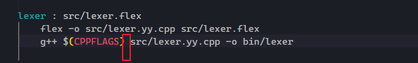

# C++

## C++历史


1. C++98
2. C++03
3. TR1:标准库的扩充
4. C++11


##  查看c++的编译器支持的版本


> 每个编译器都定义了宏 __cplusplus


## nullptr

> 用来表示空指针

```cpp
void f(int); 	//1
void f(void*);  //2

f(0);			// call 1 
f(NULL);		// 如果NULL被定义成0 那么调用1 这个有歧义
f(nullptr);     // call 2
```

> 所以空指针用nullptr,不要用NULL


# LINUX


## 切换源


### 先备份原先的源文件

```shell
sudo cp /etc/apt/sources.list /etc/apt/sources_bk.list
```


### 打开source.list,复制进阿里云镜像

```shelll
deb http://mirrors.aliyun.com/ubuntu/ xenial main restricted
deb-src http://mirrors.aliyun.com/ubuntu/ xenial main restricted multiverse universe #Added by software-properties
deb http://mirrors.aliyun.com/ubuntu/ xenial-updates main restricted
deb-src http://mirrors.aliyun.com/ubuntu/ xenial-updates main restricted multiverse universe #Added by software-properties
deb http://mirrors.aliyun.com/ubuntu/ xenial universe
deb http://mirrors.aliyun.com/ubuntu/ xenial-updates universe
deb http://mirrors.aliyun.com/ubuntu/ xenial multiverse
deb http://mirrors.aliyun.com/ubuntu/ xenial-updates multiverse
deb http://mirrors.aliyun.com/ubuntu/ xenial-backports main restricted universe multiverse
deb-src http://mirrors.aliyun.com/ubuntu/ xenial-backports main restricted universe multiverse #Added by software-properties
deb http://archive.canonical.com/ubuntu xenial partner
deb-src http://archive.canonical.com/ubuntu xenial partner
deb http://mirrors.aliyun.com/ubuntu/ xenial-security main restricted
deb-src http://mirrors.aliyun.com/ubuntu/ xenial-security main restricted multiverse universe #Added by software-properties
deb http://mirrors.aliyun.com/ubuntu/ xenial-security universe
deb http://mirrors.aliyun.com/ubuntu/ xenial-security multiverse
deb https://mirrors.tuna.tsinghua.edu.cn/ubuntu/ bionic main restricted universe multiverse
deb-src https://mirrors.tuna.tsinghua.edu.cn/ubuntu/ bionic main restricted universe multiverse
deb https://mirrors.tuna.tsinghua.edu.cn/ubuntu/ bionic-updates main restricted universe multiverse
deb-src https://mirrors.tuna.tsinghua.edu.cn/ubuntu/ bionic-updates main restricted universe multiverse
deb https://mirrors.tuna.tsinghua.edu.cn/ubuntu/ bionic-backports main restricted universe multiverse
deb-src https://mirrors.tuna.tsinghua.edu.cn/ubuntu/ bionic-backports main restricted universe multiverse
deb https://mirrors.tuna.tsinghua.edu.cn/ubuntu/ bionic-security main restricted universe multiverse
deb-src https://mirrors.tuna.tsinghua.edu.cn/ubuntu/ bionic-security main restricted universe multiverse
deb https://mirrors.tuna.tsinghua.edu.cn/ubuntu/ bionic-proposed main restricted universe muldebtiverse
deb https://mirrors.ustc.edu.cn/ubuntu/ bionic main restricted universe multiverse
deb-src https://mirrors.ustc.edu.cn/ubuntu/ bionic main restricted universe multiverse
deb https://mirrors.ustc.edu.cn/ubuntu/ bionic-updates main restricted universe multiverse
deb-src https://mirrors.ustc.edu.cn/ubuntu/ bionic-updates main restricted universe multiverse
deb https://mirrors.ustc.edu.cn/ubuntu/ bionic-backports main restricted universe multiverse
deb-src https://mirrors.ustc.edu.cn/ubuntu/ bionic-backports main restricted universe multiverse
deb https://mirrors.ustc.edu.cn/ubuntu/ bionic-security main restricted universe multiverse
deb-src https://mirrors.ustc.edu.cn/ubuntu/ bionic-security main restricted universe multiverse
```

### 更新源和软件

```shell
sudo apt-get update 
sudo apt-get upgrade
```


## 科学上网

chrome extentions:

①Adguard VPN；（免费，随便注册邮箱，速度5k左右） 

②Free VPN（免费，直接使用，速度5K左右） 

③Ghelper（需要VIP，我是白嫖的，速度最快是20K） 

④Hoxx VPN Proxy（免费，注册使用，速度1K左右）

 ⑤1Click VPN（速度2K左右）


本期视频资源地址：
1、1clickVPN：https://chrome.google.com/webstore/detail/fcfhplploccackoneaefokcmbjfbkenj
2、Astar VPN：https://chrome.google.com/webstore/detail/astar-vpn-free-and-fast-v/jajilbjjinjmgcibalaakngmkilboobh
3、VeePN：https://chrome.google.com/webstore/detail/veepn-unlimited-free-fast/majdfhpaihoncoakbjgbdhglocklcgno
4、Unlimited VPN proxy：[https://chrome.google.com/webstore/detail/unlimited-vpn-proxy-%E2%80%93-unb/nkmghlbiclohebhhoapdhcflibiibeak](https://chrome.google.com/webstore/detail/unlimited-vpn-proxy-–-unb/nkmghlbiclohebhhoapdhcflibiibeak)
5、Free VPN：https://chrome.google.com/webstore/detail/free-vpn-the-fastest-vpn/nkomfibbgccdjcahcpleidblgknecfhh


## zsh 的折腾


### 安装

```shell
sudo apt-get install -y zsh
```


### 主题-oh  my zsh

[oh-my-zsh](https://github.com/ohmyzsh/ohmyzsh/)

```shell
sh -c "$(curl -fsSL https://raw.githubusercontent.com/ohmyzsh/ohmyzsh/master/tools/install.sh)"
```

### 配置文件

```shell
~/.zshrc
```


### 设置zsh为系统登陆终端

> 新版有提示说让改默认的shell

```shell
chsh -s `which zsh`
```


### 主题


```shell
sudo apt-get install npm
npm install --global pure-prompt
```


## vscode 的折腾


### vscode 与git

#### 初始化git 

> 使得git可以追踪文件


#### 与github 同步

创建github 仓库 

vscode `ctrl shift p` 调出命令 输入

```shell
git add remote
```

复制github的链接地址

然后根据提示输入用户名和密码 

最后进行同步


### 常用插件


## windows terminal 的折腾

配置文件:

```json
// To view the default settings, hold "alt" while clicking on the "Settings" button.
// For documentation on these settings, see: https://aka.ms/terminal-documentation

{
    "$schema": "https://aka.ms/terminal-profiles-schema",

    "defaultProfile": "{c6eaf9f4-32a7-5fdc-b5cf-066e8a4b1e40}",
    "initialRows": 30,
    "initialCols": 130,
    "alwaysShowTabs": true,
    "showTerminalTitleInTitlebar": false,
    "experimental_showTabsInTitlebar": true,
    "profiles": {
        "defaults": {
            // Put settings here that you want to apply to all profiles
            "cursorColor" : "#eff300",
            "cursorShape" : "underscore",
            "fontFace" : "Cascadoa Code Regular",
            "fontSize" : 14,
            "icon": "C:/Users/tailiang/Pictures/w/linux_logo.ico",
            "useAcrylic": true,
            "acrylicOpacity": 0.9,
            "historySize": 9001,
            "name": "txl ubuntu",
            "colorScheme": "Campbell",
            "startingDirectory": "C:\\Users\\tailiang\\Desktop\\complier",
            //"backgroundImage":"C:/Users/tailiang/Pictures/w/ew.jpg",
            "backgroundImageOpacity": 0.5,
            "antialiasingMode": "aliased"
        },
        "list": [{
                // Make changes here to the powershell.exe profile
                "guid": "{61c54bbd-c2c6-5271-96e7-009a87ff44bf}",
                "name": "Windows PowerShell",
                "commandline": "powershell.exe",
                "hidden": false
            },
            {
                // Make changes here to the cmd.exe profile
                "guid": "{0caa0dad-35be-5f56-a8ff-afceeeaa6101}",
                "name": "cmd",
                "commandline": "cmd.exe",
                "hidden": false
            },
            {
                "guid": "{6f9994f0-4403-5e85-9cce-98e5da3839bb}",
                "hidden": false,
                "name": "Ubuntu-16.04",
                "source": "Windows.Terminal.Wsl"
            },
            {
                "guid": "{b453ae62-4e3d-5e58-b989-0a998ec441b8}",
                "hidden": false,
                "name": "Azure Cloud Shell",
                "source": "Windows.Terminal.Azure"
            },
            {
                "guid": "{c6eaf9f4-32a7-5fdc-b5cf-066e8a4b1e40}",
                "hidden": false,
                "name": "txl ubuntu",
                "source": "Windows.Terminal.Wsl"
            }
        ]

    },

    // Add custom color schemes to this array
    "schemes": [
        {
            "name" : "Campbell",
            "background" : "#050505",
            "black" : "#0C0C0C",
            "blue" : "#0037DA",
            "foreground" : "#F2F2F2",
            "green" : "#13A10E",
            "red" : "#C50F1F",
            "white" : "#CCCCCC",
            "yellow" : "#C19C00"
        }
    ],

    // Add any keybinding overrides to this array.
    // To unbind a default keybinding, set the command to "unbound"
    "keybindings": []

   
}
```


## ERROR :wrench:


### zsh: exec format error: bin/lexer 

> 在wsl中同样的命令 一个是在同一个文件夹下编译cpp文件 得到一个shared object 一个编译到bin目录中去,却是relocatable


#### Solve :ok:

原因是编译的时候使用了-c 选项 而这个选项不能产生二进制的执行文件

去掉-c




### file not open


#### solve  :ok:


### invalid token

> flex 没有报错 也没有warnning,但总是到文件的最后出现解析错误


#### solve :ok:

> 去掉最后的匹配 因为最后是一个EOF .也能够匹配到 所以进入了exit


> 去掉之后执行 flex会自动执行到最后


### error


## mips安装

```shell
sudo apt install gcc-mips-linux-gnu
```


检查:

```shell
mips-linux-gnu-gcc -dumpmachine
```

若输出如下,则表示成功


## qemu 安装


```shell
sudo apt-get install gcc-arm-linux-gnueabi
sudo apt-get install qemu
```


## chrome 插件


1. Astar
2. octotree
3. Vimium


## makefile


### 特殊变量

```makefile
$@ --目标文件，记忆: @谁 就是目标是谁 所以表示目标文件
$^ --所有的依赖文件，记忆:向上箭头表示依赖于上层的谁,所以是依赖文件
$< --第一个依赖文件。记忆:
$?   表示比目标还要新的依赖文件列表
```


### addprefix 函数

```makefile
$(addprefix 添加的前缀,需要添加的字符串1 需要添加的字符串2 ...)
```


### addsuffix函数

```makefile
$(addsuffix 添加的前缀,需要添加的字符串1 需要添加的字符串2 ...)
```


### wildcard 函数

> 获取和当前模式匹配的文件名

```makefile
SRC = $(wildcard *.c ./foo/*.c) #
```


###  notdir 函数

> 去除所有的目录信息


### patsubst 函数

patten substitude 模式替换

```makefile
OBJ = $(patsubst %.c %.o $(SRC)) # 在SRC中找到所有.c 结尾的文件，然后把所有的.c换成.o。
```


## linux 命令


+ 命令行中只要是`*`出现得地方,shell都会进行替换
+ shell 使用空格作为单词的分隔符


### 代码行

> 统计代码行数

```shell
 wc -l `find -name '*.cpp' `
 
 wc -l `find -name '*.hpp' `
```


### 正则

流编辑器ed file

> 在ed编辑器中,正则特定的符号只在搜索字符串中有效(第一个/后的字符串),在替换字符串中只看做普通的字符(第二个/后的字符串)


```shell
1,$p # 打印全部的行 1,$表示从第一行到最后一行
/ ... / # 查找由空格包围的三个字符
1,$s/p.o/XXX/g # 在第一行到最后一行这个范围中,s表示替换命令 将p.o 其中.表示任意一个字符 替换成XXX g表示全局替换 不单单是一行
/^the/ #查找已the开头的行
/ #表示重复上一次搜索
1,$s/^/>>/ # 在每一行开头插入>>
/\.$/ # 已.号结尾的行
1,$s/..$// # 删除每行最后两个字符
/^$/ # 空行
q # 退出
1,$s/ */ /g # 将多个空格修改成单个空格
1,$s/^.\{10\}// # 将每行开始的前10个字符删除 {n,m}匹配的次数 {要进行转义


```


### shell的执行过程

1. shell判断该命令是否为内建命令(cd,pwd,echo...),如果是,则直接执行
2. shell搜索磁盘,查找环境变量PATH中指定的所有目录,直到找到指定的程序
3. 找到后,shell会将自己复制一份(子shell)
4. 让内核使用指定的程序替换这个子shell
5. 登陆的shell会进行休眠
6. 内核将指定`程序`复制到内存中并开始执行-->`进程`


### 重定向


> 可以看出细微的差别
>
> 当wc 从test.txt文件中读取 ,那wc是知道输入的文件就是test.txt
>
> 但是当test.txt重定向给wc时,wc不知道这个东东是来自终端还是文件


### 管道

UNIX 可以将两个命令连接在一起,这种连接就是管道.--> 

>  **可以将一个命令的输出直接作为另一个命令的输入**
>
> 注意:有一个重要的前提就是第一个命令会将输出写到标准输出,而第二个命令则会从标准输入中读取输入.

```shell
ls | wc -l
# ls会将输出写到标准输出
# wc 会从标准输入中读取输入
```


### basename

> 获取最后的路径名


### wc

+ -l ;line 行数
+ -w 单词数
+ -c 字符数


### pushd 和 popd

> pushd 可以将当前目录存储起来 然后进入新的目录下工作 完了之后可以直接popd回到原来得工作路径


### ps


### ping and telnet
1. ping + ip： 查看某一个ip地址是否能够连通，如： ping 114.80.67.193

2. telnet ip port ： 查看某一个机器上的某一个端口是否可以访问，如：telnet 114.80.67.193 8080


### SQL Server 2019 安装配置


```
There are no results for TITLE: 连接到服务器 ------------------------------ 无法连接到 DESKTOP-56HQV6F。 ------------------------------ ADDITIONAL INFORMATION: 在与 SQL Server 建立连接时出现与网络相关的或特定于实例的错误。未找到或无法访问服务器。请验证实例名称是否正确并且 SQL Server 已配置为允许远程连接。 (provider: Named Pipes Provider, error: 40 - 无法打开到 SQL Server 的连接) (Microsoft SQL Server, Error: 2) For help, click: http://go.microsoft.com/fwlink?ProdName=Microsoft%20SQL%20Server&EvtSrc=MSSQLServer&EvtID=2&LinkId=20476 ------------------------------ 系统找不到指定的文件。 ------------------------------ BUTTONS: OK ------------------------------
Check your spelling or try different keywords

Ref A: 5F58F4766D5548B88B949310948C122E Ref B: BJ1EDGE0217 Ref C: 2020-04-08T13:35:27Z


```

https://www.jianshu.com/p/2ddf373cebff